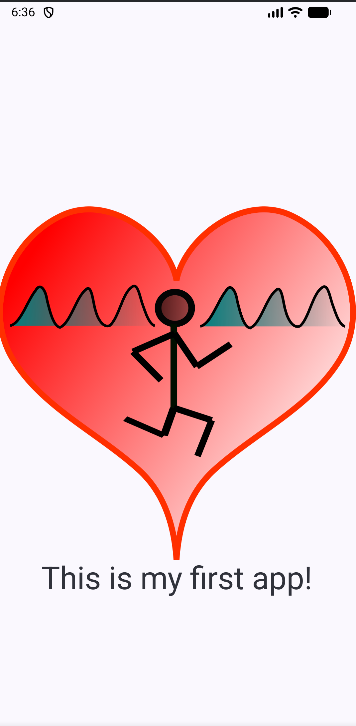

# Project Code

## Final Home Screen

This is the final home screen created in this part of the lab.

<p align="center">
  
</p>

---

# 1. Why did I create the function HomeScreen()?

Instead of putting all the UI directly inside `MainActivity`, I created a separate composable called `HomeScreen`. This makes the code easier to organize.

`MainActivity` is responsible for starting the screen, while `HomeScreen` is responsible for describing what the screen looks like.

This also makes `HomeScreen` reusable and easier to preview.

---

# 2. Why did I use @Composable?

Without `@Composable`, Kotlin treats `HomeScreen()` as a normal function.

With `@Composable`, Jetpack Compose knows that the function is allowed to create UI elements such as:

```kotlin
Surface
Column
Image
Text
```

---

# 3.  Modifier

A `Modifier` is used to change how a composable is displayed.

It can control things such as:

- size
- padding
- position
- background
- spacing

By accepting a modifier as a parameter, `HomeScreen` becomes more flexible.

For example, later we could call:

```kotlin
HomeScreen(
    modifier = Modifier.padding(16.dp)
)
```

without changing the code inside `HomeScreen`.

The part:

```kotlin
= Modifier
```

provides a default value.

That means this is valid:

```kotlin
HomeScreen()
```

because if no modifier is provided, Compose simply uses the default empty `Modifier`.

---

# 4. Surface

`Surface` is used as the main container for the screen. It gives us a place to define things such as:

- background color
- size
- shape
- elevation

In this app, I have mainly used it to create a full-screen background.

The structure is:

```text
HomeScreen
└── Surface
```

Everything else will be placed inside this `Surface`.

---

# 5. fillMaxSize()

By default, a composable may only use the space that it needs.

`fillMaxSize()` tells the `Surface`: **Use all the available width and height.**

So instead of having a small container around the content, the `Surface` covers the full screen.

---

# 6. MaterialTheme.colorScheme.background


This sets the background color of the `Surface`.

Instead of writing a fixed color such as:

```kotlin
Color.White
```

we use the color from the app theme. That is useful because the theme can change depending on the design of the app or whether the phone is using light mode or dark mode.

---

# 7. Column

I wanted to display:

1. the Sports Tracker logo
2. the text below it

Because they should appear one under another, a `Column` is a suitable layout.

The hierarchy becomes:

```text
Surface
└── Column
    ├── Image
    └── Text
```

If I had used a `Row`, the image and text would appear next to each other instead.

---

# 8. verticalArrangement = Arrangement.Center

This controls the vertical position of the items inside the `Column`.

`Arrangement.Center` tells the `Column` to place its children in the vertical center of the available space.

Without this, the content would normally begin near the top.

So this moves the logo and text toward the middle of the screen vertically.

---

# 9. horizontalAlignment = Alignment.CenterHorizontally

This controls the horizontal position of the children.

It tells the `Column` to center the image and text from left to right.

Together:

```kotlin
verticalArrangement = Arrangement.Center
horizontalAlignment = Alignment.CenterHorizontally
```

make the content appear in the center area of the screen.

---

# 10. Image

The `Image` composable displays the Sports Tracker logo. `Image` itself needs to know which image resource it should display.

That is why I used:

```kotlin
painterResource(id = R.drawable.ic_logo)
```

`painterResource()` loads an image stored in the Android project resources.

The logo is stored as a drawable resource, so I accessed it using:

```kotlin
R.drawable.ic_logo
```

```kotlin
contentDescription = "Logo Sports Tracker"
```

This is mainly for accessibility. For example, a screen reader cannot see the image, so it can use the content description to explain what the image represents.

Here it can tell the user that the image is the Sports Tracker logo.

```kotlin
Text(
    text = "This is my first app!",
    style = TextStyle(fontSize = 36.sp)
)
```

`Text` is a composable used to display text on the screen.

Here it displays:

```text
This is my first app!
```

`TextStyle` controls how the text looks. In this case, I am changing the font size.

```kotlin
fontSize = 36.sp
```

means the text should use a font size of `36`. `sp` is the Android unit normally used for text sizes.

So this line is being added because the default text size would be smaller than the size wanted for this screen.

---


